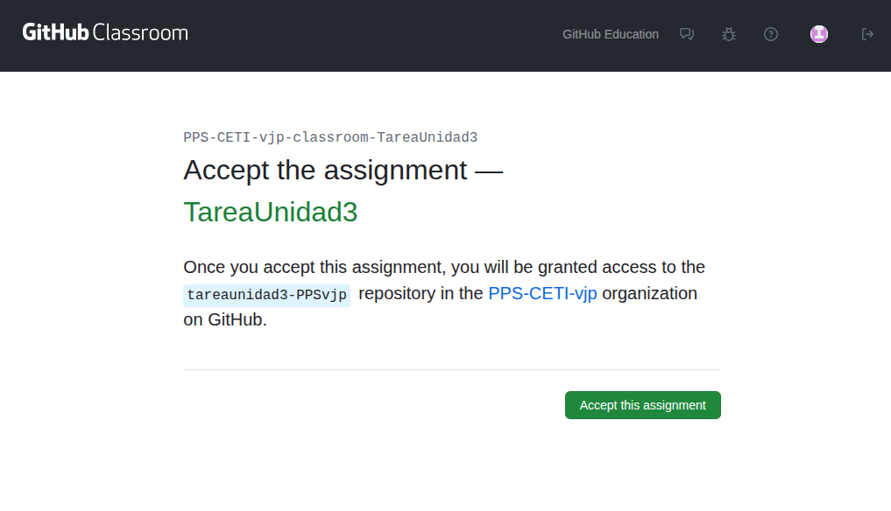
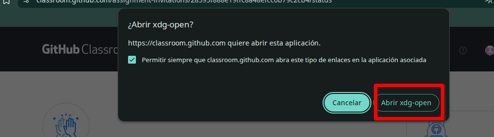
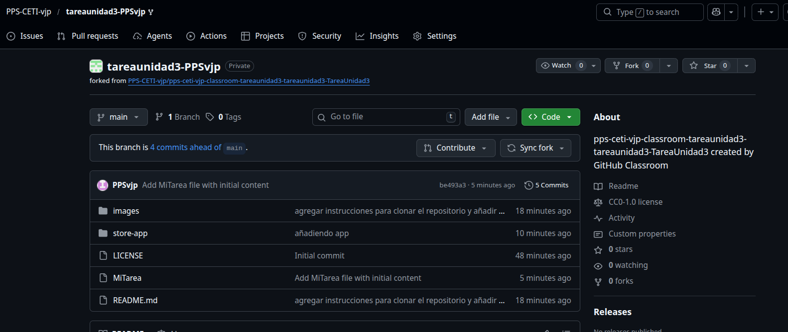

# Tarea obligatoria Unidad 4 - Tarea RA 4 Detección de problemas de seguridad en aplicaciones para dispositivos móviles

**Lee la tarea hasta el final** para ver lo que tienes que entregar e ir cogiendo las evidencias y ver lo que tienes que documentar.

Tienes información de cómo se realiza todo el proceso en las siguientes actividades:

- [Actividad Unidad 4- Modificar APK con APKTool + Jadx + Zipalign + Keytool + Apksigner: InsecureBankv2 ](../Actividad-Modificar-APK/README.md)
- [Análisis Estático y Dinámico de APK](../Actividad-Analisis-SAST-DAST-APK-MobSF-InsecureBankv2/README.md)

**Índice**

[Objetivos](#objetivos)

[Resultados de aprendizaje y Criterios de Evaluación](#resultados-de-aprendizaje-y-criterios-de-evaluación)

[Preparar el repositorio](#preparar-el-repositorio)

[Desarrollo](#desarrollo)

[Entrega](#entrega)

---
# OBJETIVOS

- Inspeccionar binarios de aplicaciones móviles para buscar fugas de información sensible.

- Aplicar metodología pentesting móvil completa (estática, dinámica, runtime y monitorización de tráfico).

- Identificar vulnerabilidades reales en APK Android moderna (Kotlin).

- Utilizar herramientas de análisis APK MobSF, APKTook, Jadx, Drozer, Frida, etc.

- Documentar hallazgos con PoCs explotables para auditoría.

- Conocer las técnicas de almacenamiento seguro de datos en los dispositivos, para evitar la fuga de información.

- Conocer las técnicas de almacenamiento seguro de datos en los dispositivos, para evitar la fuga de información.

- Saber cómo orregir y/o mitigar problemas de AndroidManifests en APK.

- Conocer y saber realizar el proceso de descompresión de APK y también las fases necesarias para crear y firmar una APK. 


---
# RESULTADOS DE APRENDIZAJE Y CRITERIOS DE EVALUACIÓN

Esta actividad se relaciona con el resultado de aprendizaje y criterios de evaluación RA 4 a-e.

---
# PREPARAR EL REPOSITORIO

Utilizaremos **`GitHub Classroom`** para la entrega de esta actividad.

- Usa este código de invitación para realizar esta tarea: https://classroom.github.com/a/3zsDx5oH

1. Pincha en el enlace y **acepta la asignación**.



2. Es posible que te aparezca un mensaje de problemas de acceso al repositorio:


3. Si es así es posible que recibas en el email vinculado a tu `Github`, un correo con la asignación.


4. Pincha en el enlace que te ha llegado al correo, **acepta la asignación** y sigue los pasos que te indican.


5.  Puedes acceder a la tarea desde el **enlace de `github` o** clonando el repositorio **desde `Visual Studio Code`**.


6. Ya podrás **acceder al repositorio** con la tarea a realizar.

7. **Guarda la dirección ya que está tarea no aparecerá en tu repositorio** al ser un repositorio del classroom https://github.com/PPS-CETI-vjp/NombreTarea-TuUSUARIOGITHUB

**Si le das a Acceder con Visual Studio Code**, tendrás que dar a permitir abrir, enlaces, descargar extensiones para vscode, confiar en los autores,etc. Se creará tu repositorio en `$HOME/Github-classroom/`.



- Si le das al repositorio, te llevará a tu repositorio. Te habrá creado un repositorio en tu espacio personal de `github classroom` que tendrás que modificar.



- Desde mi panel de control tendré acceso a tu repositorio, o sea que **ya no tendrás que poner tu repositorio como público**. Como profesor, yo tendré acceso.

---
# DESARROLLO

## Preparación del laboratorio

Herramientas y recursos necesarios:
- Aplicación APK AndroGoat.
- APKTool + Jadx: Desensamblador y extractor APK.
- MbSF: Análisis Estático y dinámico.
- Genymotion o emulador Android.
- Dispositivo virtual Andoid (Genymotion).

## Obtener AndroGoat APK:

[Aquí tienes el repositorio del repositorio de AndroGoat de Satishpatnayak.](https://github.com/satishpatnayak/AndroGoat)

Puedes obtener la apk de `AndroGoat` desde el repositorio o bien **descargándola desde el terminal**:

```bash
# Descargar apk de AndroGoat
wget https://github.com/satishpatnayak/AndroGoat/releases/latest/download/AndroGoat.apk
```

## 1. Apartado 1 - APKTool + JADX

1. **Realiza una extracción-decompilado** de la aplicación con **APKTool + JADX**.
2. Raliza el **Análisis del `AndroidManifest.xml`**.
3. Extrae el `AndroidManifest.xml` y el código de la apliación.
4. Localiza los posibles problemas que pueda haber en el código fuente: Credenciales hardcodeadas, SharedPreferences inseguros, URLs backend expuestas, etc.

## Apartado 2 - Análisis de AndroGoat.

1. Realiza el **Análisis estático** de la aplicación con `MobSF`.
2.  Indica **cuál es la versión de Android mínima soportada por la aplicación `AndroGoat`**.
3. Sube el informe del análisis estático a la [carpeta `files` del repositorio](./files/) .
4. **Crea el laboratorio para la emulación** de un dispositivo virtual con **Android 8.1**.Realiza el **Análisis dinámico** de la aplicación (p.e con `Drozer` o con `MobSF`).
5. Sube el informe del análisis dinámico a la [carpeta `files` del repositorio.](./files/).  
6. Haz un **análisis de los resultados** .

## Apartado 3 - Solución de problemas y reempaquetado de AndroGoat.

1. Soluciona los problemas de la aplicación presentes en el `Manifest`.
2. Reempaqueta, alinea y firma la aplicación. El nombre de la apk debe de ser **AndrogoatTuNombre.apk**.
3. Sube la aplicación a la carpeta files del repositorio.
3. Vuleve a hacer análisis estático que demuestre que se han solucionado los problemas.
 
# Entrega

## Indicaciones de entrega

Al acceder a la tarea en `classroom.github.com` se te ha creado un repositorio. En él es en el que tendrás que documentar la realización de los diferentes apartados de la tarea.

> Observa que al ser repositorio privado, no te va a permitir configurar `GitHub Pages`. No obstante **deberás configurar `Mkdocs` para que genere las páginas html** sobre los archivos `.md` donde estás documentando todo.

> Recuerda **añadir toda la estructura** de `mkdocs`, `requeriments.txt` y el `workflow` de `GitHub Actions` para que se genere la documentación en la rama `GH-Pages`.
>
> **Para visualizar los archivos `html`** que se están creando con ` mkdocs`, con php podemos **crear un servidor web** para visualizar los archivos creados: `php -S 0:8080` nos muestra el contenido web del directorio actual, por lo que si yo estoy en la rama `gh-pages` podré ver los archivos `html` generados.

```bash
# creo una carpeta donde visualizar mi web
mkdir /ruta/a/carpeta/web
# Clono mi respositorio
git clone Mirespositorio/MiTareaUnidadX.git 
# Me coloco en la carpeta clonada
cd MiTareaUnidadX
# Me cambio a la rama gh-pages
git checkout gh-pages
# Levantamos el servidor web con php
php -S 0:8080
```

Visualizaríamos el contenido web de nuestro respositorio en <http://localhost:8080>


Una vez realizada la tarea, el envío se realizará a través de la plataforma.

**Deberás de entregar** al menos:

- El **repositorio** que has creado, **comprimido** en un archivo.
- El **enlace** a tu repositorio en la página de `classroom.github.com`.

La documentación generada en la rama `gh-pages` del repositorio (*recuerda que se generan los archivos .md colocados en la carpeta docs*) debe de contener al menos:
- Archivo **Index.md** con enlace al resto de secciones.

- Las siguientes **secciones**:

    - **Apartado 1: APKTool + JADX**.

    - **Apartado 2 - Análisis estático y dinámico de AndroGoat**.

    - **Apartado 3 - Solución de problemas y reempaquetado de AndroGoat**.

El archivo comprimido se nombrará siguiendo las siguientes pautas:

`PPS-Unidad-TareaRA-Apellido1_Apellido2_Nombre`

Asegúrate que el nombre no contenga la letra ñ, tildes ni caracteres especiales extraños. Así por ejemplo la alumna Begoña Sánchez Mañas para la primera unidad del MP de PPS, debería nombrar esta tarea como...

`PPS-Unidad2-TareaRA2-sanchez_manas_begona`

## Calificación de la tarea

La puntuación de los apartados es la siguiente:

Si **no se adjunta el repositorio comprimido o no se indica la dirección de la documentación del repositorio en classroom.github.com**, la tarea será **calificada como 0**

> NOTA IMPORTANTE
> 
> El **objetivo principal de esta unidad es la detección de los problemas de seguridad** en los dispositivos móviles, por lo tanto, la **ejecución de las herramientas de análisis NO SON la finalidad**, sino una mera herramienta para obtener problemas. **LO PRINCIPAL ES EL ANÁLISIS DE LOS RESULTADOS OBTENIDOS**, por lo que se debe prestar **atención especial al análisis** de los datos obtenidos en el análisis estático y dinámico de la APK.
>
> **Aquellos apartados/subapartados en los que las capturas de pantalla no sean claras o no tengan como fondo de pantalla la plataforma con tu usuario mostrando claramente la foto de tu perfil, no serán corregidos**.

En el resto de los casos, la **puntuación** de los apartados es la siguiente:
1. **Apartado 1 - APKTool + JADX**: (Extracción apktool y jadx: 1 punto. Anális de problemas presentes: 1 punto. Total hasta 2 puntos).
1. **Apartado 2 - Análisis estático y dinámico de AndroGoat** (Ejecución Estático+informe: 1 punto, Dinámico + informe: 1 punto. Análisis: 2 puntos. Total hasta 4 puntos).
1. **Apartado 3 - Solución de problemas y reempaquetado de AndroGoat**: ((Modificación de problemas: 1 punto, Empaquetado y firma de apk: 1 puntos. Total hasta 2 puntos)).
1. **Documentación: presentación, extensión, exactitud, riqueza en síntaxis de MarkDown, etc.** de la documentación del repostorio. (hasta 2 puntos).

--- 
[](https://creativecommons.org/licenses/by-nc-sa/4.0/)

