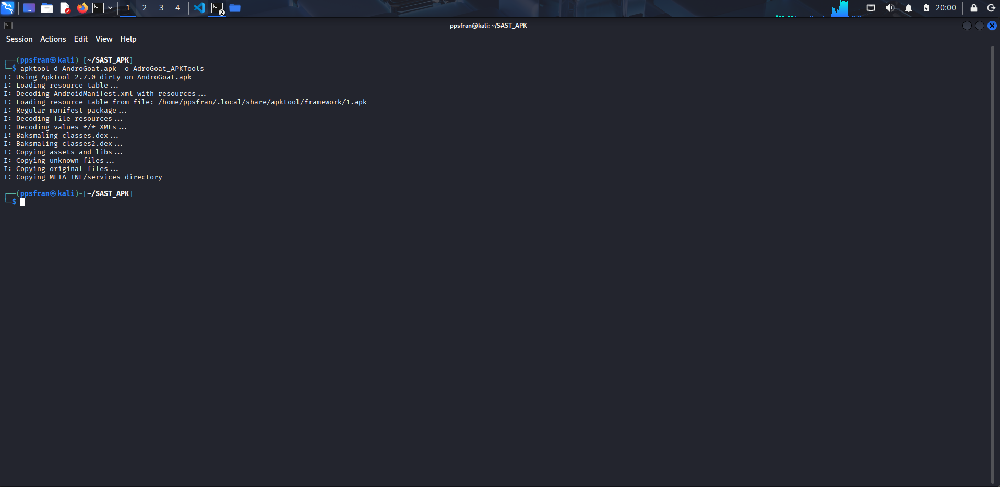
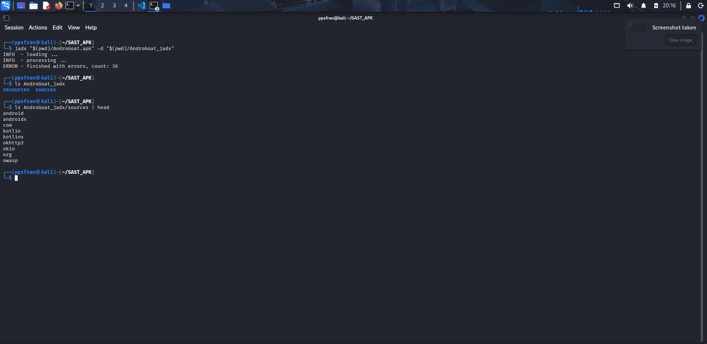
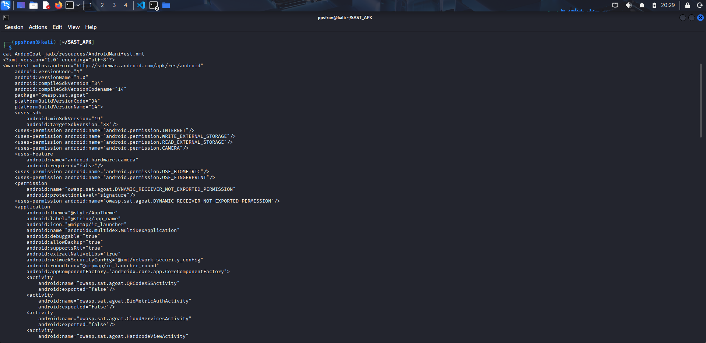
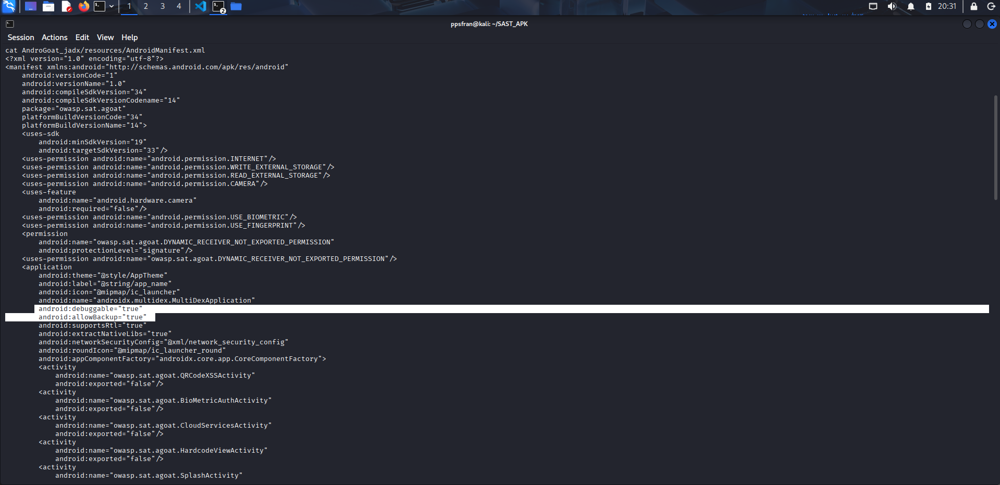
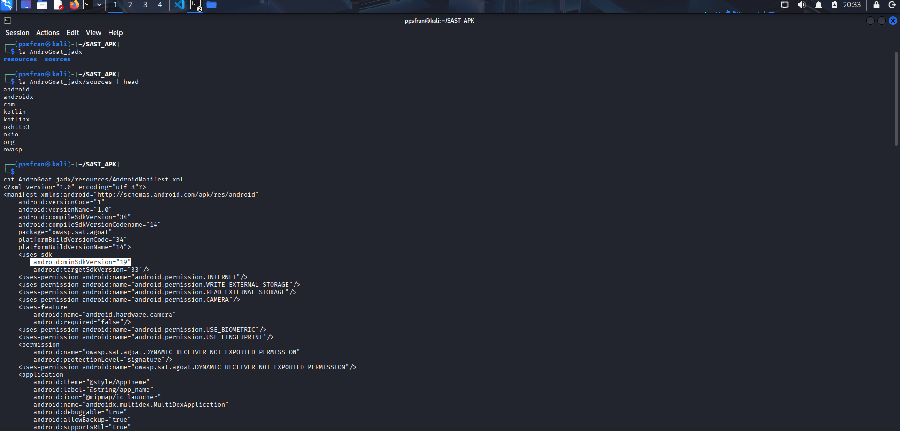

# 1. Apartado 1 - APKTool + JADX

## 1. **Realiza una extracción-decompilado** de la aplicación con **APKTool + JADX**.

### Decompilado con APKTool 

* Para descompilar con APKTool hay que poner el siguiente como 
```
apktool d AndroGoat.apk -o salida_apktool
```
* como vemos en la imagen empieza a descompilar toda la app:




### DECOMPILADO CON JADX 

* Para descomplar con comando con JADX hay que utilizar lo siguiente:
  
```
 jadx "$(pwd)/AndroGoat.apk" -d "$(pwd)/AndroGoat_jadx"
```

* Como vemos en la imagen empieza a descompilar el apk:




## 📄 2. Análisis del AndroidManifest.xml

---

## Información General

Abrimos el manifiesto y lo primero que vemos son los datos básicos de la app:


```bash
cat AndroGoat_jadx/resources/AndroidManifest.xml
```

En esta tabla pongo el contenido general del manifest:

| Campo | Valor |
|:------|:------|
| **Package** | `owasp.sat.agoat` |
| **Versión** | `1.0` |
| **minSdkVersion** | `19` (Android 4.4) |
| **targetSdkVersion** | `33` (Android 13) |

---



## 1. Los parametros  peligrosos son los siguientes: 

Lo primero que llama la atención está aquí:

```xml
<application
    android:debuggable="true"
    android:allowBackup="true">
```



**`debuggable="true"`** — La app está en modo debug. Esto permite que cualquiera se conecte con `adb` y acceda a sus datos internos sin necesidad de root. Esto jamás debería estar en una app real.

**`allowBackup="true"`** — Con un simple comando `adb backup` puedes sacar toda la información de la app, incluyendo bases de datos y archivos privados.

---

## 2. SDK mínimo bajo

```xml
<uses-sdk android:minSdkVersion="19"/>
```

Soporta Android 4.4 del 2013. Una versión tan antigua tiene muchísimas vulnerabilidades conocidas sin parchear.



---

## 3. Permisos peligrosos

```xml
<uses-permission android:name="android.permission.WRITE_EXTERNAL_STORAGE"/>
<uses-permission android:name="android.permission.READ_EXTERNAL_STORAGE"/>
<uses-permission android:name="android.permission.USE_FINGERPRINT"/>
```

Los permisos de almacenamiento externo son los más preocupantes, cualquier app puede leer lo que esta escriba en la SD.

---

## 4. Componentes expuestos

Aquí está lo más grave. Hay varios componentes accesibles desde fuera de la app sin ninguna protección.

**Activity con Deep Link:**
```xml
<activity
    android:name="owasp.sat.agoat.AccessControl1ViewActivity"
    android:exported="true">
    <data android:scheme="androgoat" android:host="vulnapp"/>
</activity>
```
Cualquiera puede abrir esta pantalla directamente con `androgoat://vulnapp` saltándose cualquier control de acceso.

**Broadcast Receiver abierto:**
```xml
<receiver
    android:name="owasp.sat.agoat.ShowDataReceiver"
    android:exported="true"/>
```
Sin ningún permiso. Cualquier app puede enviarle mensajes y activar su lógica interna.

**Servicio exportado:**
```xml
<service
    android:name="owasp.sat.agoat.DownloadInvoiceService"
    android:exported="true"/>
```
Un servicio de descarga de facturas accesible por cualquier app del dispositivo.

**Content Provider con PINs:**
```xml
<provider
    android:name="owasp.sat.agoat.ContentProviderActivity"
    android:exported="true"
    android:authorities="owasp.sat.agoat.provider.userpinsprovider"/>
```
El más preocupante. Almacena PINs de usuario y está completamente abierto. Se puede consultar así:

```bash
adb shell content query \
    --uri content://owasp.sat.agoat.provider.userpinsprovider/
```

---

## Resumen

| # | Hallazgo | Severidad |
|:-:|:---------|:---------:|
| 1 | `android:debuggable="true"` | 🔴 Crítico |
| 2 | Content Provider de PINs sin protección | 🔴 Crítico |
| 3 | Broadcast Receiver sin permisos | 🔴 Crítico |
| 4 | Servicio de facturas exportado | 🔴 Crítico |
| 5 | Deep Link sin validación | 🔴 Crítico |
| 6 | `android:allowBackup="true"` | 🟠 Alto |
| 7 | Almacenamiento externo | 🟠 Alto |
| 8 | `minSdkVersion="19"` | 🟡 Medio |
| 9 | `USE_FINGERPRINT` obsoleto | 🟡 Medio |


1. Extrae el `AndroidManifest.xml` y el código de la apliación.


4. Localiza los posibles problemas que pueda haber en el código fuente: Credenciales hardcodeadas, SharedPreferences inseguros, URLs backend expuestas, etc.


